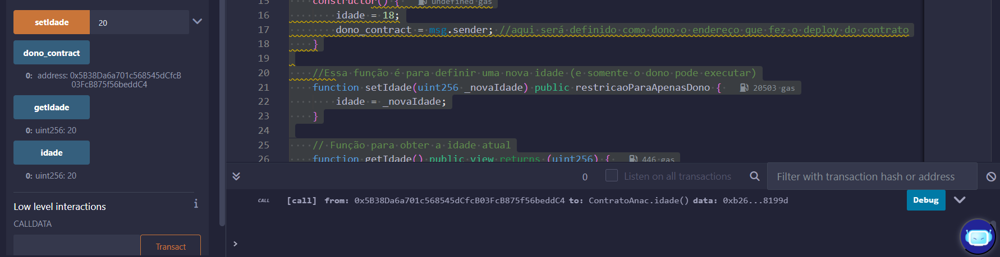

# Ponderada Smart Contract

```solidity
// Código da ponderada
pragma solidity ^0.4.0;

contract ContratoAnac {
    uint256 public idade; // Armazena a idade
    address public dono_contract; // Armazena o dono do contrato

    // Modificador que permite apenas ao dono executar certas funções
    modifier restricaoParaApenasDono() {
        require(msg.sender == dono_contract, "somente o dono pode modificar a idade");
        //O código irá começar antes daqui para validar se é o dono, se for, o "_" irá ser substituido pelo código da função modifier
        _;
    }

    // Construtor que define a idade inicial e o dono do contrato
    constructor() {
        idade = 18;
        dono_contract = msg.sender; //aqui será definido como dono o endereço que fez o deploy do contrato
    }

    //Essa função é para definir uma nova idade (e somente o dono pode executar)
    function setIdade(uint256 _novaIdade) public restricaoParaApenasDono {
        idade = _novaIdade;
    }

    // Função para obter a idade atual
    function getIdade() public view returns (uint256) {
        return idade;
    }
}

```

Para o processo de criação desse código, eu interpretei o que estava sendo pedido como primeiro passo. Após, eu comecei a desenvolver o código com todo o conhecimento eu havia adquirido através dos estudos, porém, em certo momento da segunda parte, eu precisei pedir ajuda ao chatGPT, pois eu não sabia como eu poderia fazer a parte do dono, pedi para que ele me dissesse como eu poderia fazer em código isso e também o que realmente estava sendo feito.


Para provar que o deply realmente foi feito, aqui está a imagen mostrando o teste:




